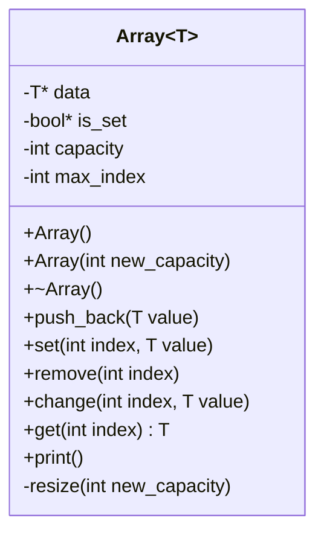
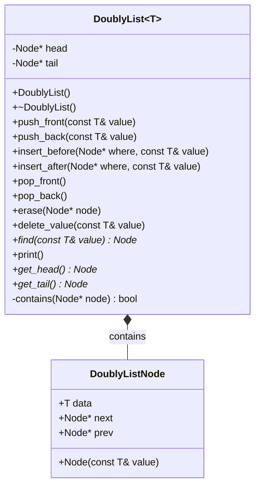
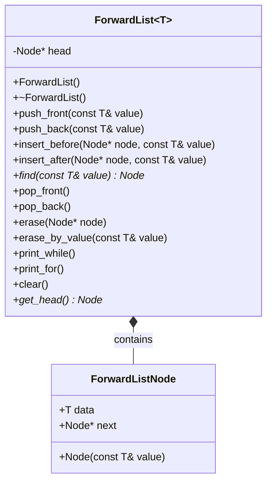
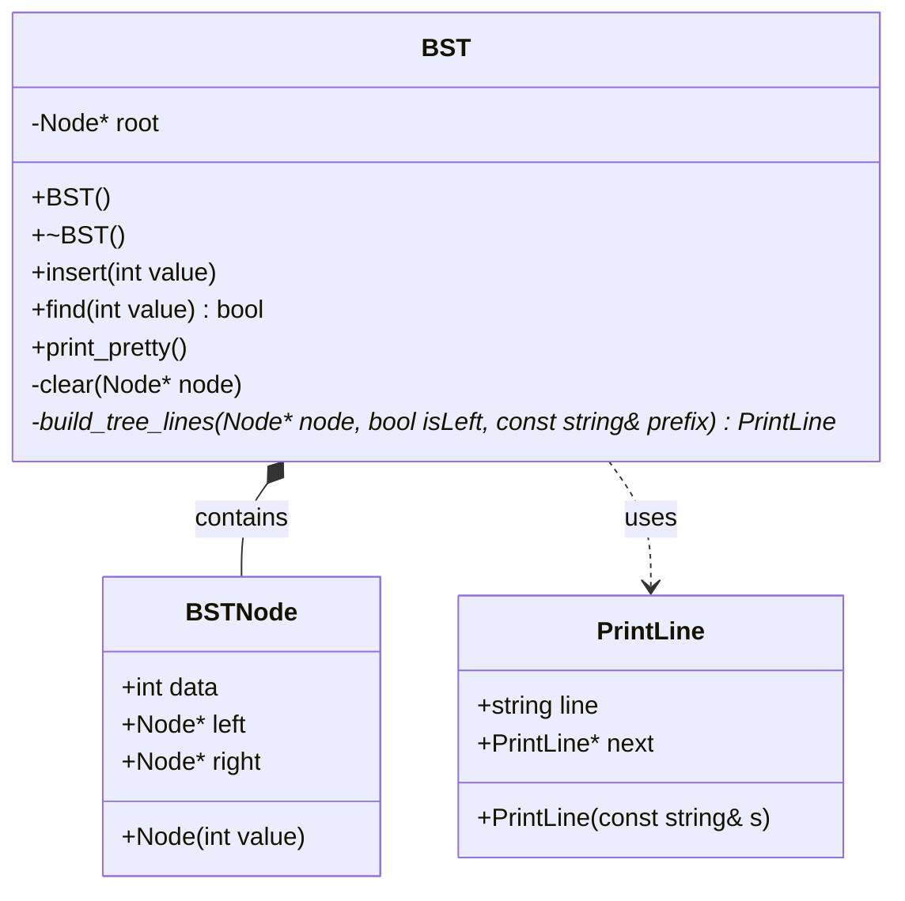
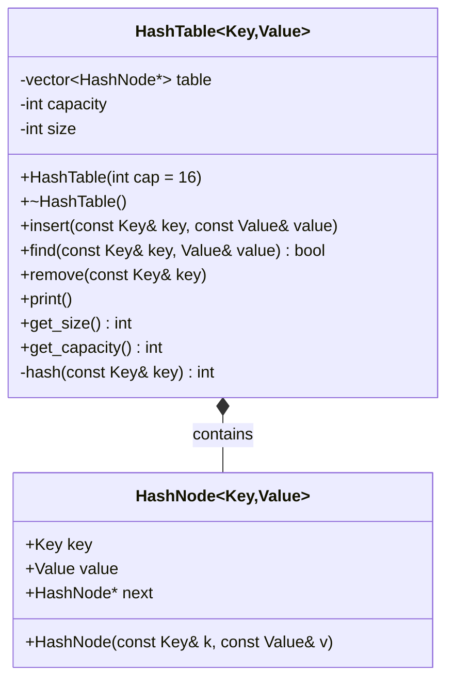
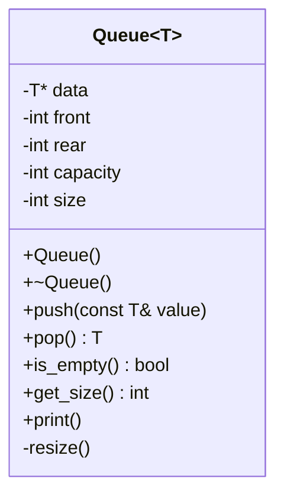
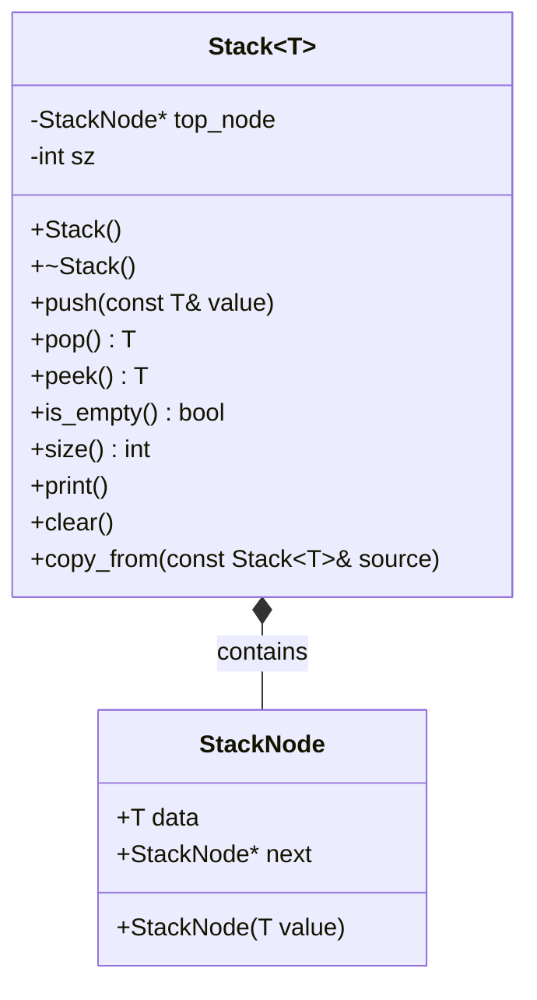

# UML Диаграммы классов

## Общая диаграмма всех классов

```mermaid
classDiagram
    class Array~T~ {
        -T* data
        -bool* is_set
        -int capacity
        -int max_index
        +Array()
        +Array(int new_capacity)
        +~Array()
        +push_back(T value)
        +set(int index, T value)
        +remove(int index)
        +change(int index, T value)
        +get(int index) T
        +print()
        -resize(int new_capacity)
    }

    class DoublyList~T~ {
        -Node* head
        -Node* tail
        +DoublyList()
        +~DoublyList()
        +push_front(const T& value)
        +push_back(const T& value)
        +insert_before(Node* where, const T& value)
        +insert_after(Node* where, const T& value)
        +pop_front()
        +pop_back()
        +erase(Node* node)
        +delete_value(const T& value)
        +find(const T& value) Node*
        +print()
        +get_head() Node*
        +get_tail() Node*
        -contains(Node* node) bool
    }

    class DoublyListNode {
        +T data
        +Node* next
        +Node* prev
        +Node(const T& value)
    }

    class ForwardList~T~ {
        -Node* head
        +ForwardList()
        +~ForwardList()
        +push_front(const T& value)
        +push_back(const T& value)
        +insert_before(Node* node, const T& value)
        +insert_after(Node* node, const T& value)
        +find(const T& value) Node*
        +pop_front()
        +pop_back()
        +erase(Node* node)
        +erase_by_value(const T& value)
        +print_while()
        +print_for()
        +clear()
        +get_head() Node*
    }

    class ForwardListNode {
        +T data
        +Node* next
        +Node(const T& value)
    }

    class BST {
        -Node* root
        +BST()
        +~BST()
        +insert(int value)
        +find(int value) bool
        +print_pretty()
        -clear(Node* node)
        -build_tree_lines(Node* node, bool isLeft, const string& prefix) PrintLine*
    }

    class BSTNode {
        +int data
        +Node* left
        +Node* right
        +Node(int value)
    }

    class PrintLine {
        +string line
        +PrintLine* next
        +PrintLine(const string& s)
    }

    class HashTable~Key,Value~ {
        -vector~HashNode*~ table
        -int capacity
        -int size
        +HashTable(int cap = 16)
        +~HashTable()
        +insert(const Key& key, const Value& value)
        +find(const Key& key, Value& value) bool
        +remove(const Key& key)
        +print()
        +get_size() int
        +get_capacity() int
        -hash(const Key& key) int
    }

    class HashNode~Key,Value~ {
        +Key key
        +Value value
        +HashNode* next
        +HashNode(const Key& k, const Value& v)
    }

    class Queue~T~ {
        -T* data
        -int front
        -int rear
        -int capacity
        -int size
        +Queue()
        +~Queue()
        +push(const T& value)
        +pop() T
        +is_empty() bool
        +get_size() int
        +print()
        -resize()
    }

    class Stack~T~ {
        -StackNode* top_node
        -int sz
        +Stack()
        +~Stack()
        +push(const T& value)
        +pop() T
        +peek() T
        +is_empty() bool
        +size() int
        +print()
        +clear()
        +copy_from(const Stack~T~& source)
    }

    class StackNode {
        +T data
        +StackNode* next
        +StackNode(T value)
    }

    DoublyList *-- DoublyListNode : contains
    ForwardList *-- ForwardListNode : contains
    BST *-- BSTNode : contains
    BST ..> PrintLine : uses
    HashTable *-- HashNode : contains
    Stack *-- StackNode : contains
```

## Диаграмма Array

## Диаграмма DoublyList

## Диаграмма ForwardList

## Диаграмма BST

## Диаграмма HashTable

## Диаграмма Queue

## Диаграмма Stack

## Примечания

- **PlantUML файл**: `uml_diagrams.puml` - можно открыть в PlantUML редакторах или онлайн на plantuml.com
- **Mermaid диаграммы**: Этот файл содержит диаграммы в формате Mermaid, которые поддерживаются GitHub, GitLab и многими редакторами
- Все классы шаблонные (template), что обозначено как `~T~` или `~Key,Value~`
- Связи между классами:
  - `*--` означает композицию (содержит)
  - `..>` означает использование (dependency)

